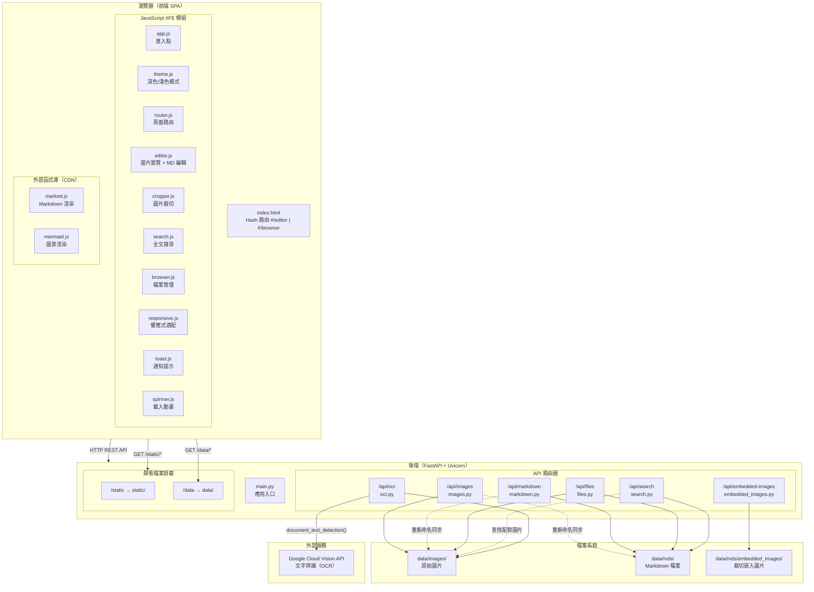
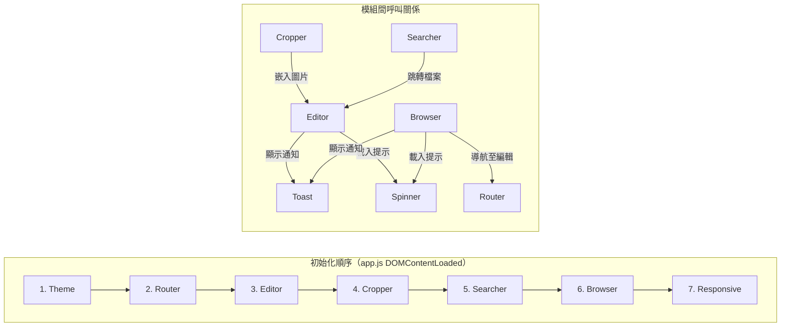
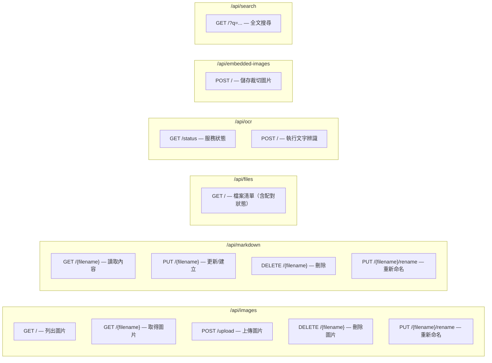
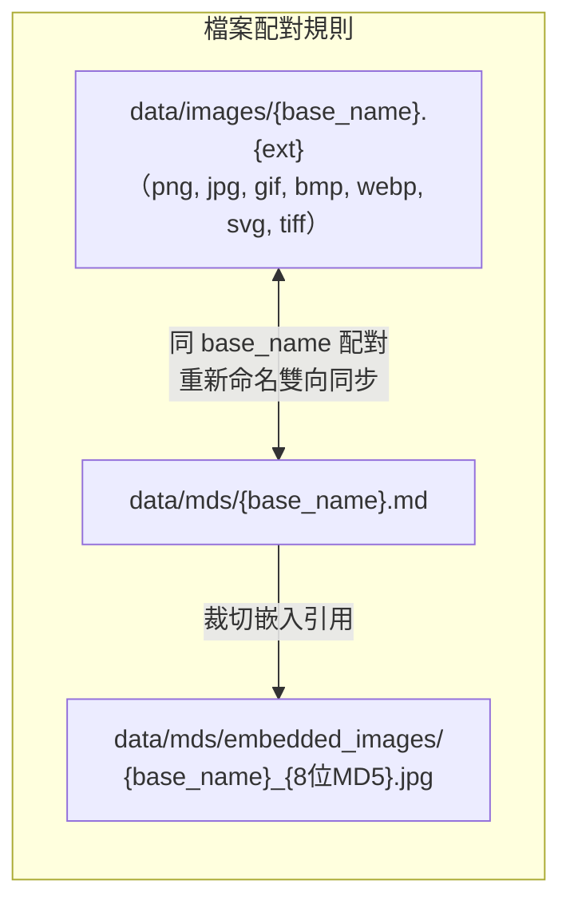
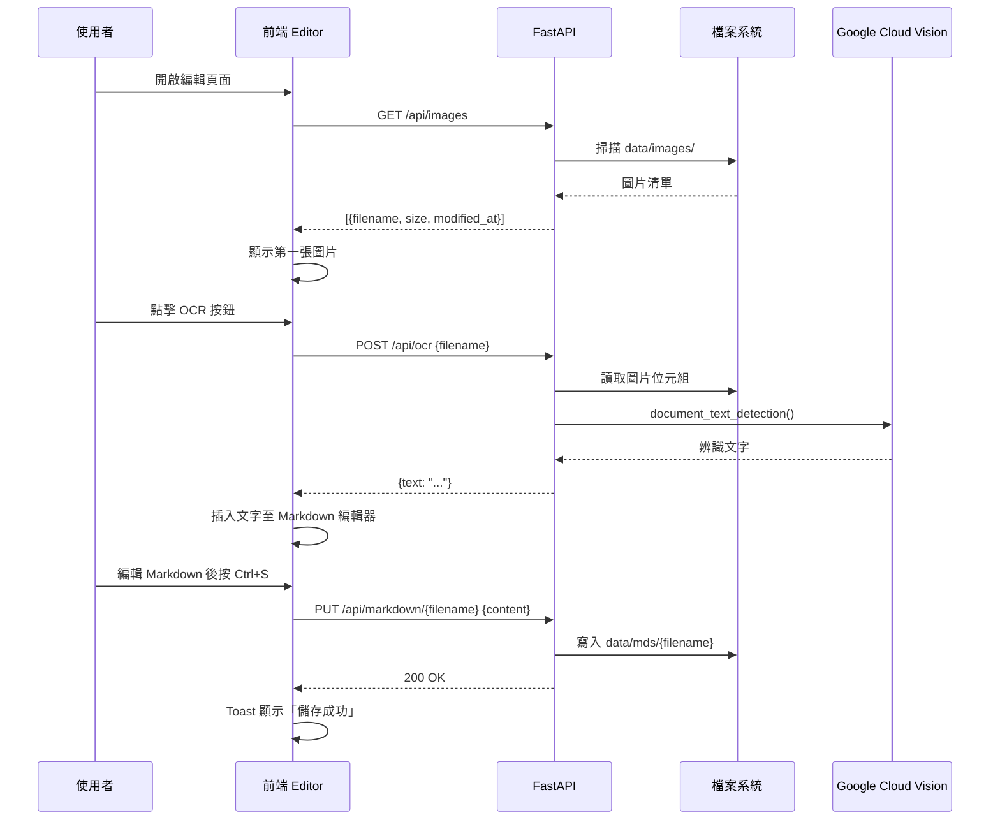

# 系統架構圖

## 整體架構總覽

```mermaid
graph TB
    subgraph Client["瀏覽器（前端 SPA）"]
        direction TB
        HTML["index.html<br/>Hash 路由 #/editor | #/browser"]

        subgraph JSModules["JavaScript IIFE 模組"]
            direction LR
            App["app.js<br/>進入點"]
            Theme["theme.js<br/>深色/淺色模式"]
            RouterJS["router.js<br/>頁面路由"]
            EditorJS["editor.js<br/>圖片瀏覽 + MD 編輯"]
            CropperJS["cropper.js<br/>圖片裁切"]
            SearchJS["search.js<br/>全文搜尋"]
            BrowserJS["browser.js<br/>檔案管理"]
            Responsive["responsive.js<br/>響應式適配"]
            Toast["toast.js<br/>通知提示"]
            Spinner["spinner.js<br/>載入動畫"]
        end

        subgraph ExtLibs["外部函式庫（CDN）"]
            Marked["marked.js<br/>Markdown 渲染"]
            Mermaid["mermaid.js<br/>圖表渲染"]
        end
    end

    subgraph Server["後端（FastAPI + Uvicorn）"]
        MainPy["main.py<br/>應用入口"]

        subgraph Routers["API 路由器"]
            ImagesAPI["/api/images<br/>images.py"]
            MarkdownAPI["/api/markdown<br/>markdown.py"]
            FilesAPI["/api/files<br/>files.py"]
            OCRAPI["/api/ocr<br/>ocr.py"]
            EmbeddedAPI["/api/embedded-images<br/>embedded_images.py"]
            SearchAPI["/api/search<br/>search.py"]
        end

        subgraph StaticMount["靜態檔案掛載"]
            StaticFiles["/static → static/"]
            DataMount["/data → data/"]
        end
    end

    subgraph Storage["檔案系統"]
        ImagesDir["data/images/<br/>原始圖片"]
        MdsDir["data/mds/<br/>Markdown 檔案"]
        EmbeddedDir["data/mds/embedded_images/<br/>裁切嵌入圖片"]
    end

    subgraph External["外部服務"]
        GCV["Google Cloud Vision API<br/>文字辨識（OCR）"]
    end

    %% 前端 → 後端
    Client -- "HTTP REST API" --> Server
    Client -- "GET /static/*" --> StaticMount
    Client -- "GET /data/*" --> DataMount

    %% 後端 → 檔案系統
    ImagesAPI --> ImagesDir
    ImagesAPI -.->|重新命名同步| MdsDir
    MarkdownAPI --> MdsDir
    MarkdownAPI -.->|重新命名同步| ImagesDir
    FilesAPI --> ImagesDir
    FilesAPI --> MdsDir
    EmbeddedAPI --> EmbeddedDir
    SearchAPI --> MdsDir
    SearchAPI -.->|查找配對圖片| ImagesDir
    OCRAPI --> ImagesDir
    OCRAPI -- "document_text_detection()" --> GCV
```

## 前端模組初始化與依賴關係

```mermaid
graph LR
    subgraph InitOrder["初始化順序（app.js DOMContentLoaded）"]
        direction LR
        T["1. Theme"] --> R["2. Router"] --> E["3. Editor"] --> C["4. Cropper"] --> S["5. Searcher"] --> B["6. Browser"] --> RS["7. Responsive"]
    end

    subgraph Dependencies["模組間呼叫關係"]
        direction TB
        Editor2["Editor"]
        Cropper2["Cropper"]
        Searcher2["Searcher"]
        Browser2["Browser"]
        Toast2["Toast"]
        Spinner2["Spinner"]
        Router2["Router"]

        Editor2 -->|"顯示通知"| Toast2
        Editor2 -->|"載入提示"| Spinner2
        Cropper2 -->|"嵌入圖片"| Editor2
        Searcher2 -->|"跳轉檔案"| Editor2
        Browser2 -->|"導航至編輯"| Router2
        Browser2 -->|"顯示通知"| Toast2
        Browser2 -->|"載入提示"| Spinner2
    end
```

## API 端點總覽

```mermaid
graph LR
    subgraph ImagesCRUD["/api/images"]
        I1["GET / — 列出圖片"]
        I2["GET /{filename} — 取得圖片"]
        I3["POST /upload — 上傳圖片"]
        I4["DELETE /{filename} — 刪除圖片"]
        I5["PUT /{filename}/rename — 重新命名"]
    end

    subgraph MarkdownCRUD["/api/markdown"]
        M1["GET /{filename} — 讀取內容"]
        M2["PUT /{filename} — 更新/建立"]
        M3["DELETE /{filename} — 刪除"]
        M4["PUT /{filename}/rename — 重新命名"]
    end

    subgraph FilesList["/api/files"]
        F1["GET / — 檔案清單（含配對狀態）"]
    end

    subgraph OCR["/api/ocr"]
        O1["GET /status — 服務狀態"]
        O2["POST / — 執行文字辨識"]
    end

    subgraph EmbeddedImg["/api/embedded-images"]
        E1["POST / — 儲存裁切圖片"]
    end

    subgraph Search["/api/search"]
        S1["GET /?q=... — 全文搜尋"]
    end
```

## 檔案關聯模式

```mermaid
graph LR
    subgraph Pairing["檔案配對規則"]
        IMG["data/images/{base_name}.{ext}<br/>（png, jpg, gif, bmp, webp, svg, tiff）"]
        MD["data/mds/{base_name}.md"]
        EMB["data/mds/embedded_images/<br/>{base_name}_{8位MD5}.jpg"]

        IMG <-->|"同 base_name 配對<br/>重新命名雙向同步"| MD
        MD -->|"裁切嵌入引用"| EMB
    end
```

## 資料流：圖片編輯與 OCR 流程

```mermaid
sequenceDiagram
    participant U as 使用者
    participant FE as 前端 Editor
    participant API as FastAPI
    participant FS as 檔案系統
    participant GCV as Google Cloud Vision

    U->>FE: 開啟編輯頁面
    FE->>API: GET /api/images
    API->>FS: 掃描 data/images/
    FS-->>API: 圖片清單
    API-->>FE: [{filename, size, modified_at}]
    FE->>FE: 顯示第一張圖片

    U->>FE: 點擊 OCR 按鈕
    FE->>API: POST /api/ocr {filename}
    API->>FS: 讀取圖片位元組
    API->>GCV: document_text_detection()
    GCV-->>API: 辨識文字
    API-->>FE: {text: "..."}
    FE->>FE: 插入文字至 Markdown 編輯器

    U->>FE: 編輯 Markdown 後按 Ctrl+S
    FE->>API: PUT /api/markdown/{filename} {content}
    API->>FS: 寫入 data/mds/{filename}
    API-->>FE: 200 OK
    FE->>FE: Toast 顯示「儲存成功」
```
